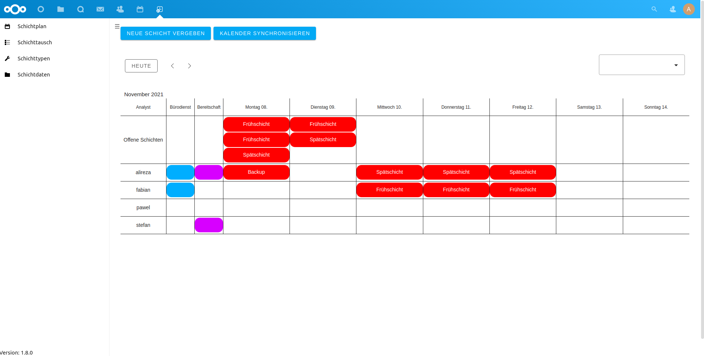

# Nextcloud Shifts

A shiftsplaner app for [Nextcloud](https://nextcloud.com).





## Why is this so awesome?

* **Interactions with the Nextcloud Calender app!** Easy integration into the existing Calender of Nextcloud.
* **Manage and organize your Shifts System!** Customize your Shifts Model with different Shifttypes 
* **Separation of Users by different Nextcloud user Groups!** Divide your Workforce with different Skill-Levels


More to come:
* Further maturing of the app
* Individualisation


If you experience any issues or have any suggestions for improvement, use the issue tracker.

## Get on board
For new contributors, please check out [ContributingToNextcloudIntroductoryWorkshop](https://github.com/sleepypioneer/ContributingToNextcloudIntroductoryWorkshop)


## Development
### Setup

Just clone this repo into your apps directory ([Nextcloud server](https://github.com/nextcloud/server#running-master-checkouts) installation needed). Additionally, [npm](https://www.npmjs.com/) to fetch [Node.js](https://nodejs.org/en/download/package-manager/) is needed for installing JavaScript dependencies.

Once npm and Node.js are installed, PHP and JavaScript dependencies can be installed by running:
```bash
make dev-setup
```

### Translation
Documentation for Nextcloud translation: https://docs.nextcloud.com/server/22/developer_manual/basics/front-end/l10n.html

Nextcloud translation tool: https://github.com/nextcloud/docker-ci/tree/master/translations/translationtool

1. Generate .pot file: ```translationtool.phar create-pot-files```
2. Copy the template file into the language directory: ```cp shifts/translationfiles/templates/shifts.pot shifts/translationfiles/de/shifts.po```
3. Edit po file
4. Convert po file: ```translationtool.phar convert-po-files```

## Documentation

* [Admin documentation](docs/README.md) (installation, configuration, troubleshooting)
